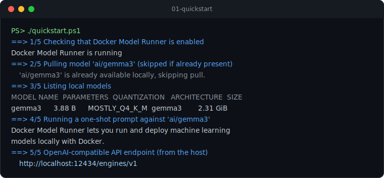

# 01 - Quickstart

Pull a model, run a one-shot prompt and discover the OpenAI-compatible API endpoint, all in a single script.



## Prerequisites

- Docker Desktop 4.40+ with Docker Model Runner enabled
  (Settings -> AI -> Enable Docker Model Runner, plus host-side TCP support on port 12434).

## Run it

The default model is `ai/gemma3`. Override it with the `MODEL` environment variable.

### bash / macOS / Linux

```bash
chmod +x quickstart.sh
./quickstart.sh

# or with a different model
MODEL=ai/llama3.2 ./quickstart.sh
```

### PowerShell / Windows

```powershell
./quickstart.ps1

# or with a different model
$env:MODEL = "ai/llama3.2"; ./quickstart.ps1
```

## What it does

1. Checks that Docker Model Runner is running (`docker model status`).
2. Pulls the model, skipping the download if it is already present.
3. Lists the models available locally (`docker model list`).
4. Runs a one-shot prompt (`docker model run`).
5. Prints the host API endpoint: `http://localhost:12434/engines/v1`.

Both scripts are idempotent, so re-running them will not re-download a model you already have.

## Next

Head to [02-openai-api](../02-openai-api) to call the model over the OpenAI-compatible API.
