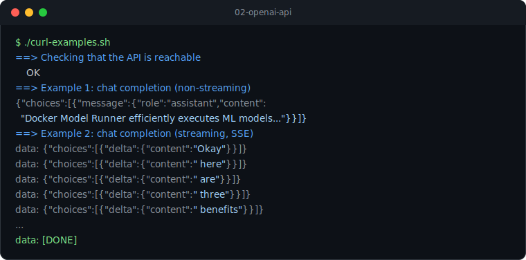

# 02 - OpenAI-compatible API

Docker Model Runner exposes an OpenAI-compatible API, so any OpenAI client or plain `curl` works against it.

- From the host: `http://localhost:12434/engines/v1`
- From inside a container: `http://model-runner.docker.internal/engines/v1`

No API key is required, but OpenAI client libraries usually expect a non-empty one, so pass any placeholder value.



## curl

```bash
chmod +x curl-examples.sh
./curl-examples.sh

# override the model
MODEL=ai/llama3.2 ./curl-examples.sh
```

The script sends two requests to `POST /chat/completions`:

1. A normal chat completion that returns a single JSON response.
2. A streaming completion (`"stream": true`) that returns server-sent `data:` chunks ending with `data: [DONE]`.

## VS Code REST Client

Open [chat.http](chat.http) in VS Code with the
[REST Client](https://marketplace.visualstudio.com/items?itemName=humao.rest-client) extension installed,
then click **Send Request** above any request. The `@baseUrl` and `@model` variables at the top
mirror the same calls as the curl script.

## Next

Move on to [03-dotnet-chat](../03-dotnet-chat) to consume the same API from a .NET app.
