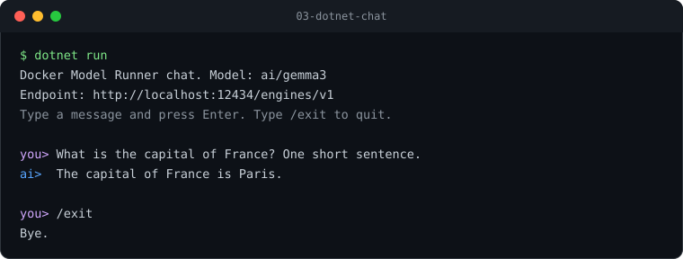

# 03 - .NET streaming chat

A minimal .NET 10 console app that holds a streaming chat conversation with a model served by
Docker Model Runner, using the official [`OpenAI`](https://www.nuget.org/packages/OpenAI) NuGet package (2.x).

Because DMR is OpenAI-compatible, the only DMR-specific detail is the base URL.



## Prerequisites

- .NET 10 SDK
- Docker Model Runner enabled, with the model pulled (see [01-quickstart](../01-quickstart)).

## Configuration

| Variable          | Default                                 | Description                    |
| ----------------- | --------------------------------------- | ------------------------------ |
| `OPENAI_BASE_URL` | `http://localhost:12434/engines/v1`     | DMR OpenAI-compatible endpoint |
| `MODEL`           | `ai/gemma3`                             | Model to chat with             |

## Run

```bash
dotnet run

# or target a different model
MODEL=ai/llama3.2 dotnet run
```

```powershell
dotnet run

# or target a different model
$env:MODEL = "ai/llama3.2"; dotnet run
```

## Sample session

```
Docker Model Runner chat. Model: ai/gemma3
Endpoint: http://localhost:12434/engines/v1
Type a message and press Enter. Type /exit to quit. Ctrl+C cancels and exits.

you> What is Docker Model Runner in one sentence?
ai>  Docker Model Runner lets you pull and run LLMs locally through Docker with an OpenAI-compatible API.

you> /exit
Bye.
```

The response streams in token by token, and the conversation history is kept across turns so
the model has context.

Press **Ctrl+C** to cancel an active model request and exit cleanly. It also exits while
waiting for keyboard input. A canceled or failed exchange is not added to the conversation
history; partial output already printed remains visible in the terminal.

## Next

See [04-compose](../04-compose) to provision the model and the app together with Docker Compose.

## History limits

| Variable | Default | Meaning |
| --- | --- | --- |
| `CHAT_MAX_HISTORY_CHARS` | `16000` | Maximum text retained as model context and sent in one request, including the system message and current prompt |
| `CHAT_MAX_HISTORY_TURNS` | `10` | Maximum completed user/assistant exchanges retained |

The system message is always preserved. Old exchanges are dropped as complete pairs,
keeping the most recent contiguous history that fits. Failed or stopped requests do not
change retained exchanges. Prompts exceeding the available character budget are rejected
before calling the model. If a completed prompt/reply pair is too large to retain, it is
shown but not remembered; the application reports this and preserves prior context.

Characters are counted as .NET UTF-16 code units, not model tokens. This is a predictable
text-size bound, not a guarantee of fitting every model's context window: tokenization,
message framing and space for generated output differ by model. Lower the limit for models
with smaller contexts. The limit does not truncate an in-progress generated response.
Unset or empty settings use defaults; invalid or nonpositive settings are rejected, and
the character budget must exceed the system-message length.

```bash
CHAT_MAX_HISTORY_CHARS=8000 CHAT_MAX_HISTORY_TURNS=5 dotnet run
```

```powershell
$env:CHAT_MAX_HISTORY_CHARS = "8000"
$env:CHAT_MAX_HISTORY_TURNS = "5"
dotnet run
```
