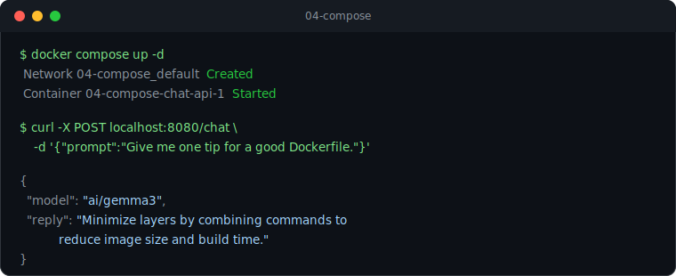

# 04 - Docker Compose

Provision the model and a small app together with a single `docker compose up`.



The [`compose.yaml`](compose.yaml) uses the top-level `models` element so Compose makes
`ai/gemma3` available through Docker Model Runner, and binds it to the `chat-api` service
using the long syntax. Compose injects two environment variables into the container:

| Variable          | Injected value (example)                  |
| ----------------- | ----------------------------------------- |
| `OPENAI_BASE_URL` | `http://model-runner.docker.internal/v1`  |
| `MODEL`           | `ai/gemma3`                               |

The app trims any trailing slash and uses this value as the OpenAI base URL, so it works
whether the runner exposes the API at `/v1` or `/engines/v1`.

The app ([app/](app)) is a .NET 10 minimal API with one endpoint, `POST /chat`, that forwards
a prompt to the model and returns the reply. It reuses the same OpenAI SDK pattern as
[03-dotnet-chat](../03-dotnet-chat).

## Prerequisites

- Docker Desktop 4.40+ with Docker Model Runner enabled.
- Compose v2.35+ (ships with recent Docker Desktop).

## Run

```bash
docker compose up --build
```

Compose pulls the model if needed, builds the app image and starts the service.

## Try it

```bash
# Health and configuration
curl http://localhost:8080/

# Send a prompt
curl -X POST http://localhost:8080/chat \
  -H "Content-Type: application/json" \
  -d '{ "prompt": "Give me one tip for writing a good Dockerfile." }'
```

Example response:

```json
{ "model": "ai/gemma3", "reply": "Use a small base image and a multi-stage build to keep the final image lean." }
```

## Pre-built image

[](https://github.com/ppiova/docker-model-runner-lab/pkgs/container/docker-model-runner-lab%2Fcompose-api)

A ready-to-run image is published to GitHub Container Registry by the
[publish workflow](../.github/workflows/publish.yml). Run it without cloning the repo:

```bash
docker run --rm -p 8080:8080 \
  -e OPENAI_BASE_URL=http://model-runner.docker.internal/engines/v1 \
  -e MODEL=ai/gemma3 \
  ghcr.io/ppiova/docker-model-runner-lab/compose-api:latest
```

Docker Model Runner must be enabled so the container can reach `model-runner.docker.internal`.

## Stop

```bash
docker compose down
```
