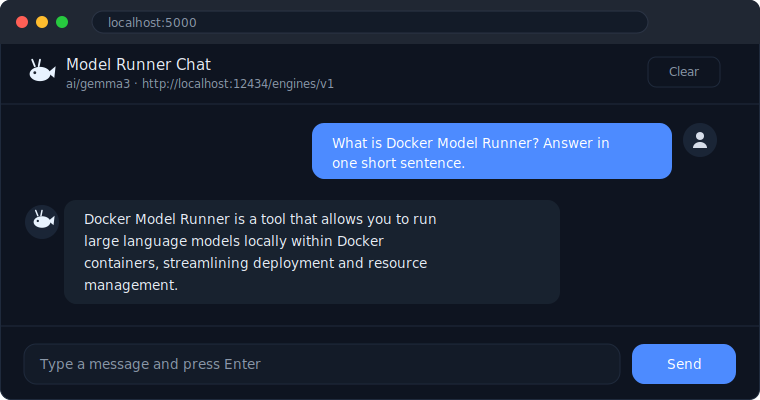

# 05 - Blazor chat UI

A web chat interface for Docker Model Runner, built with **Blazor Server (.NET 10)**.

The OpenAI SDK runs server-side (the same pattern as [03-dotnet-chat](../03-dotnet-chat) and
[04-compose](../04-compose)), and the model streams its answer token by token to the browser over
the Blazor SignalR connection. No CORS setup, no API key, no data leaving your machine.



## Features

- Streaming responses rendered live, with a typing indicator while the model thinks.
- Conversation history kept across turns so the model has context.
- Model name and endpoint shown in the header (resolved from configuration).
- Light and dark theme, following your system preference.
- Friendly error message if the model endpoint is unreachable.

## Configuration

| Variable          | Default                             | Description                    |
| ----------------- | ----------------------------------- | ------------------------------ |
| `OPENAI_BASE_URL` | `http://localhost:12434/engines/v1` | DMR OpenAI-compatible endpoint |
| `MODEL`           | `ai/gemma3`                         | Model to chat with             |

## Run locally

```bash
dotnet run
```

Then open the URL shown in the console (by default `http://localhost:5000`).

## Run with Docker Compose

This builds the app image and provisions the model together. Open `http://localhost:8080`
once it is up.

```bash
docker compose up --build
```

Compose injects `OPENAI_BASE_URL` and `MODEL` into the container, so the app talks to the model
at `http://model-runner.docker.internal` with no extra configuration.

## Pre-built image

[](https://github.com/ppiova/docker-model-runner-lab/pkgs/container/docker-model-runner-lab%2Fblazor-chat)

A ready-to-run image is published to GitHub Container Registry by the
[publish workflow](../.github/workflows/publish.yml). Run it without cloning the repo:

```bash
docker run --rm -p 8080:8080 \
  -e OPENAI_BASE_URL=http://model-runner.docker.internal/engines/v1 \
  -e MODEL=ai/gemma3 \
  ghcr.io/ppiova/docker-model-runner-lab/blazor-chat:latest
```

Then open `http://localhost:8080`. Docker Model Runner must be enabled so the container can reach
`model-runner.docker.internal`.

## Stop

```bash
docker compose down
```
