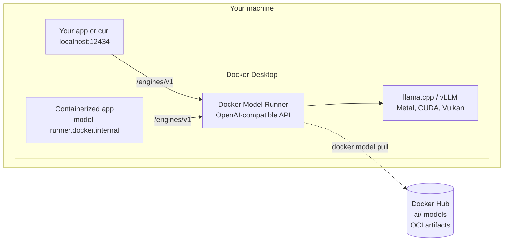
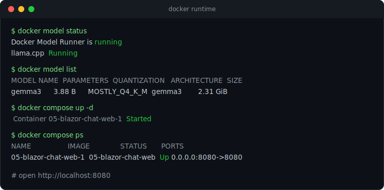

<div align="center">

# 🐳 docker-model-runner-lab

**Run LLMs locally with Docker Model Runner. No cloud, no API keys, no data leaving your machine.**

[](https://github.com/ppiova/docker-model-runner-lab/actions/workflows/ci.yml)
[](LICENSE)
[](https://dotnet.microsoft.com/)
[](https://www.docker.com/products/docker-desktop/)

<!--  -->

</div>

## What is Docker Model Runner

Docker Model Runner (DMR) pulls and runs LLMs locally with the same workflow you already use for containers.
Models are OCI artifacts on Docker Hub under the [`ai/` namespace](https://hub.docker.com/u/ai), served through an
OpenAI-compatible API, so your existing SDKs and tools work unchanged. Everything stays on your machine.



## Quickstart in 3 commands

> Prerequisite: Docker Desktop 4.40+ with Model Runner enabled
> (Settings -> AI -> Enable Docker Model Runner, plus host-side TCP support).

```bash
docker model pull ai/gemma3
docker model run ai/gemma3 "Hello in one sentence"
curl http://localhost:12434/engines/v1/models
```

## The lab

Five hands-on modules, from zero to a Blazor web chat backed by a local model. Each one is self-contained.

| Module | What you build | Time |
| ------ | -------------- | ---- |
| [01-quickstart](01-quickstart) | Pull, list and run a model with idempotent bash and PowerShell scripts | 5 min |
| [02-openai-api](02-openai-api) | Raw API calls with curl and the VS Code REST Client, including streaming | 5 min |
| [03-dotnet-chat](03-dotnet-chat) | A .NET 10 streaming chat console app using the official OpenAI SDK | 10 min |
| [04-compose](04-compose) | Model + web API provisioned together with the Compose `models` element | 10 min |
| [05-blazor-chat](05-blazor-chat) | A .NET 10 Blazor Server web UI that streams chat responses from the model | 10 min |

All examples default to `ai/gemma3` and accept a `MODEL` environment variable to swap models without touching code.

> Every module was tested end to end with .NET 10 and `ai/gemma3` on Docker Desktop, running on the llama.cpp backend.

## Running in Docker

The model and the app run as containers side by side. The model is provisioned by Docker Model
Runner and the apps reach it at `model-runner.docker.internal`, all from a single `docker compose up`.



The web apps are also published as ready-to-run images on GitHub Container Registry, built by the
[publish workflow](.github/workflows/publish.yml):

| Image | Module | Pull |
| ----- | ------ | ---- |
| [](https://github.com/ppiova/docker-model-runner-lab/pkgs/container/docker-model-runner-lab%2Fcompose-api) | [04-compose](04-compose) | `docker pull ghcr.io/ppiova/docker-model-runner-lab/compose-api:latest` |
| [](https://github.com/ppiova/docker-model-runner-lab/pkgs/container/docker-model-runner-lab%2Fblazor-chat) | [05-blazor-chat](05-blazor-chat) | `docker pull ghcr.io/ppiova/docker-model-runner-lab/blazor-chat:latest` |

## Endpoints

| Where your code runs | Base URL |
| -------------------- | -------- |
| On the host | `http://localhost:12434/engines/v1` |
| Inside a container | `http://model-runner.docker.internal/engines/v1` |

No API key is required. If your client library demands one, pass any placeholder string.

## `docker model` cheat sheet

| Command | What it does |
| ------- | ------------ |
| `docker model pull ai/gemma3` | Download a model from Docker Hub |
| `docker model list` | List local models |
| `docker model run ai/gemma3 "prompt"` | One-shot prompt |
| `docker model run ai/gemma3` | Interactive chat (`/bye` to exit) |
| `docker model ps` | Show models loaded in memory |
| `docker model status` | Check the runner and its backends |
| `docker model inspect ai/gemma3` | Show model details |
| `docker model rm ai/gemma3` | Remove a local model |

## llama.cpp vs vLLM

DMR ships two inference engines:

| | llama.cpp | vLLM |
| --- | --------- | ---- |
| Model format | GGUF | Safetensors |
| Sweet spot | Laptops, CPU or mixed CPU/GPU, single user | High-throughput GPU serving, many concurrent requests |
| GPU support | Metal, CUDA, Vulkan | CUDA (Linux) |

Rule of thumb: start with llama.cpp for local development, reach for vLLM when you need throughput at scale.

## Troubleshooting

<details>
<summary><code>docker: 'model' is not a docker command</code></summary>

Your Docker Desktop is older than 4.40. Update it, then enable Model Runner under Settings -> AI.
</details>

<details>
<summary><code>Docker Model Runner is not running</code></summary>

Enable it from the CLI with `docker desktop enable model-runner`, or in Docker Desktop under
Settings -> AI -> Enable Docker Model Runner.
</details>

<details>
<summary>Connection refused on <code>localhost:12434</code></summary>

Host-side TCP support is disabled. Turn it on in Docker Desktop under Settings -> AI
(Enable host-side TCP support), keeping the default port 12434.
</details>

<details>
<summary>The first response takes a long time</summary>

The model loads into memory on the first request. Subsequent requests are much faster.
Check what is loaded with <code>docker model ps</code>.
</details>

## Resources

- [Docker Model Runner docs](https://docs.docker.com/ai/model-runner/)
- [Compose `models` element](https://docs.docker.com/ai/compose/models-and-compose/)
- [Model Runner on GitHub](https://github.com/docker/model-runner)
- [Model catalog on Docker Hub](https://hub.docker.com/u/ai)

---

<div align="center">

**[Pablo Piovano](https://www.linkedin.com/in/ppiova/)** &nbsp;|&nbsp; [Docker Captain](https://www.docker.com/captains/) &nbsp;&middot;&nbsp; [Microsoft MVP](https://mvp.microsoft.com/en-us/PublicProfile/5004753)

</div>
